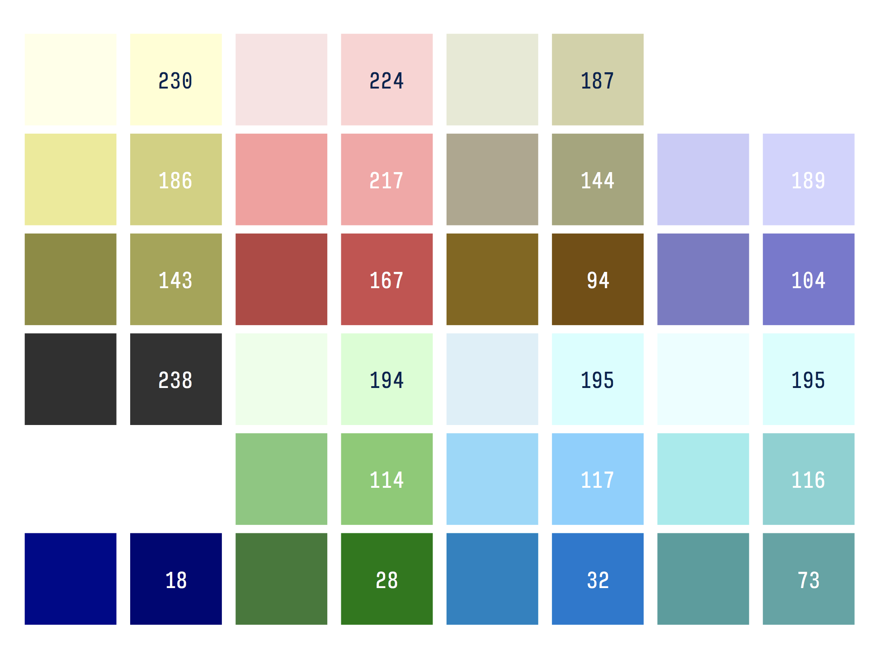

# VACME

A Vim colorscheme based on [plan9](https://en.wikipedia.org/wiki/Plan_9_from_Bell_Labs)
and the [Acme editor](http://acme.cat-v.org). 
In keeping with Acme, it doesn't do syntax highlighting (almost).
Instead, colors are only used to define vim's interface.
Bold and italics are used sparingly.

-   Compatible with 16-color terminals using a terminal theme.
    A theme for Apple Terminal is included.
    GUI support is included.

    The general philosophy for terminal colors
    is that the 2 darkest shades are handled by your terminal
    (which can typically do true colors)
    and the lightest are handled in 256.

## Screenshot

## Color Palette

